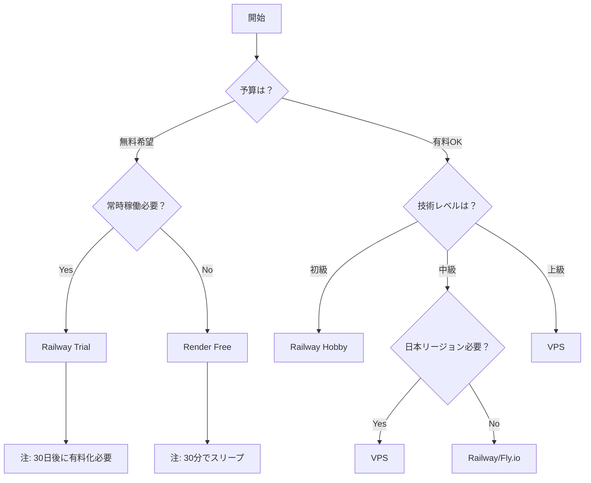

# Railway デプロイメント比較表

> TravelAssistant向けホスティングサービス詳細比較

## 📊 サービス比較マトリックス

### 基本情報

| 項目 | Railway | Render | Fly.io | VPS (さくら/ConoHa) | Vercel |
|------|---------|--------|--------|-------------------|--------|
| **初期費用** | $0 | $0 | $0 | ¥0 | $0 |
| **最小月額** | $0.50 | $0 | $0 | ¥600 | $0 |
| **無料枠** | $5/月 | 750時間/月 | $5相当 | なし | 制限付き |
| **24/7稼働** | ✅ | ⚠️ | ✅ | ✅ | ❌ |
| **日本リージョン** | ❌ | ⚠️ | ⚠️ | ✅ | ✅ |
| **設定難易度** | ⭐ | ⭐⭐ | ⭐⭐⭐ | ⭐⭐⭐⭐ | ⭐ |

### Discord Bot対応

| 機能 | Railway | Render | Fly.io | VPS | Vercel |
|------|---------|--------|--------|-----|--------|
| **WebSocket対応** | ✅ | ✅ | ✅ | ✅ | ❌ |
| **永続接続** | ✅ | ⚠️ | ✅ | ✅ | ❌ |
| **公式テンプレート** | ✅ | ⚠️ | ❌ | ❌ | ❌ |
| **自動再起動** | ✅ | ✅ | ✅ | 要設定 | N/A |
| **ログ確認** | ✅ | ✅ | ✅ | ✅ | ✅ |

### パフォーマンス・制限

| 項目 | Railway | Render | Fly.io | VPS | Vercel |
|------|---------|--------|--------|-----|--------|
| **CPU制限** | 8 vCPU | 0.5 CPU | 共有 | 専有 | 制限あり |
| **メモリ上限** | 8GB | 512MB (無料) | 256MB (無料) | プラン次第 | 1GB |
| **ストレージ** | 10GB | なし | 3GB | プラン次第 | なし |
| **帯域幅** | 100GB/月 | 100GB/月 | 無制限 | プラン次第 | 100GB/月 |
| **スリープ** | なし | 30分 | なし | なし | 即座 |

### 開発者体験

| 機能 | Railway | Render | Fly.io | VPS | Vercel |
|------|---------|--------|--------|-----|--------|
| **GitHub連携** | ✅ | ✅ | ✅ | 手動 | ✅ |
| **自動デプロイ** | ✅ | ✅ | ✅ | 要設定 | ✅ |
| **環境変数UI** | ✅ | ✅ | ❌ | ❌ | ✅ |
| **CLI** | ✅ | ✅ | ✅ | SSH | ✅ |
| **ロールバック** | ✅ | ✅ | ✅ | 手動 | ✅ |

## 💡 選択フローチャート



## 🔍 詳細な考慮事項

### Railway を選ぶべき場合

- ✅ Discord Bot専用で使いたい
- ✅ すぐに始めたい（5分でデプロイ）
- ✅ 月額$5以内で収めたい
- ✅ 設定の手間を最小限にしたい
- ✅ 安定性を重視する

### Render を選ぶべき場合

- ✅ 無料で始めたい
- ✅ スリープしても問題ない
- ✅ PostgreSQL/Redisも使いたい
- ✅ 複数のサービスを連携させたい

### Fly.io を選ぶべき場合

- ✅ グローバル展開を考えている
- ✅ エッジコンピューティングが必要
- ✅ 高度なネットワーク設定が必要
- ✅ コンテナベースで運用したい

### VPS を選ぶべき場合

- ✅ 完全な制御が必要
- ✅ 日本リージョンが必須
- ✅ 複数のBotを運用する
- ✅ カスタムソフトウェアが必要
- ✅ サーバー管理の経験がある

## 📈 コスト予測（TravelAssistant運用）

### 想定使用量

- Bot稼働時間: 24時間/日
- アクティブユーザー: 1名（個人利用）
- API呼び出し: 100回/日
- データ転送: 1GB/月

### 月額コスト予測

| サービス | 最小構成 | 推奨構成 | 備考 |
|---------|---------|---------|------|
| Railway | $0.50 | $1.50 | 安定性重視 |
| Render | $0 | $7 | 無料は制限あり |
| Fly.io | $0.50 | $3.00 | リージョン追加で増加 |
| さくらVPS | ¥643 | ¥1,738 | 年払い割引あり |
| ConoHa | ¥682 | ¥1,848 | 時間課金可能 |

## 🚀 移行パス

### 段階的な成長戦略

```text
Phase 1: Railway Trial ($0)
  ↓ 30日後
Phase 2: Railway Hobby ($0.50-5/月)
  ↓ 機能制限に直面したら
Phase 3: VPS or Fly.io ($5-10/月)
  ↓ スケール必要時
Phase 4: Kubernetes/専用サーバー
```

## 📋 チェックリスト

### Railway 採用前の確認事項

- [ ] クレジットカードを用意できるか
- [ ] 米国リージョンのレイテンシは許容範囲か
- [ ] Cronジョブが不要、または代替手段があるか
- [ ] 月額$5の予算は確保できるか
- [ ] シンプルな構成で十分か

### 他サービス検討のトリガー

- [ ] 月額使用量が$5を大幅に超える
- [ ] 日本リージョンが必須になった
- [ ] 複雑なバックグラウンド処理が必要
- [ ] 複数のBotを運用する必要がある
- [ ] カスタムソフトウェアのインストールが必要

---

最終更新: 2025年1月
※価格・仕様は変更される可能性があります
