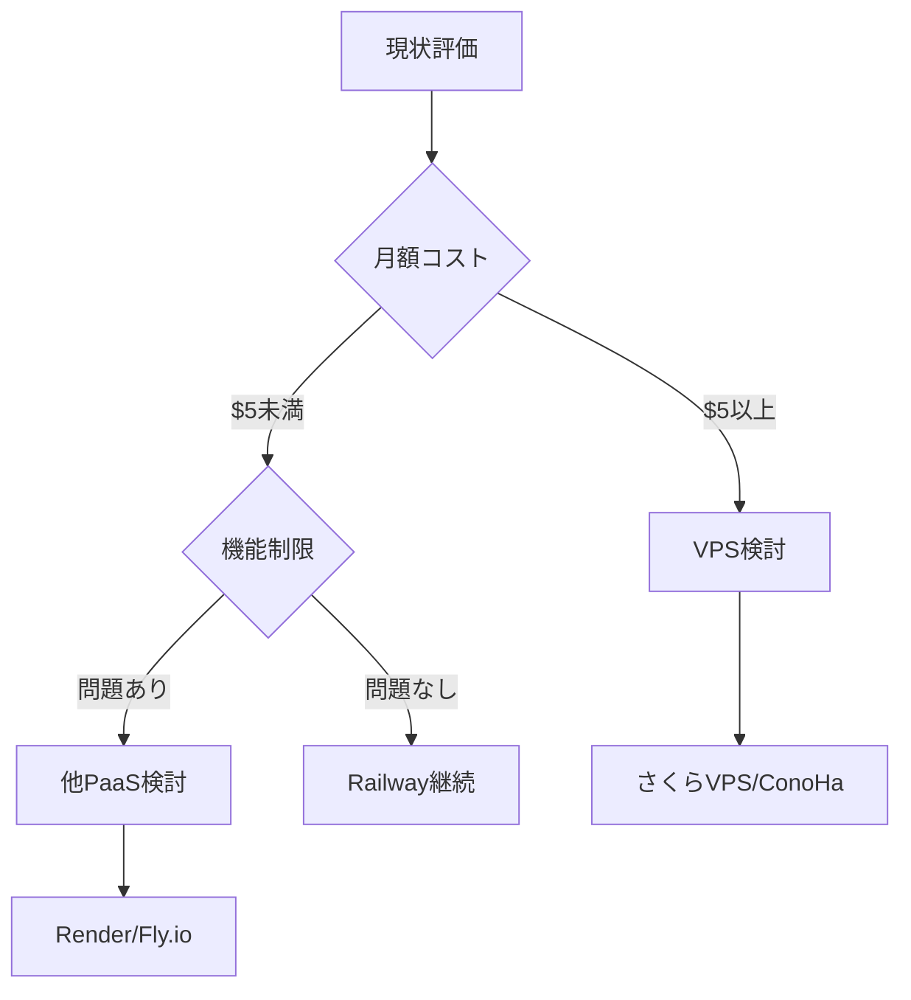

# Railway デプロイメントガイド

> TravelAssistant Discord BotをRailwayにデプロイするための詳細ガイド

## 📋 目次

- [概要](#概要)
- [料金体系](#料金体系)
- [事前準備](#事前準備)
- [デプロイ手順](#デプロイ手順)
- [設定とカスタマイズ](#設定とカスタマイズ)
- [運用・監視](#運用監視)
- [トラブルシューティング](#トラブルシューティング)
- [移行計画](#移行計画)

## 概要

RailwayはDiscord Bot向けに最適化されたクラウドホスティングプラットフォームです。GitHub連携による自動デプロイ、24/7稼働保証、シンプルな設定が特徴です。

### なぜRailwayを選ぶのか

- **簡単セットアップ**: 5分でデプロイ完了
- **低コスト**: 個人利用なら月額$1未満も可能
- **安定性**: 99.9%以上の稼働率（実測値）
- **Discord Bot特化**: 公式テンプレート多数

## 料金体系

### プラン詳細（2025年1月現在）

| プラン | 月額基本料金 | 含まれる使用量 | 特徴 |
|--------|-------------|---------------|------|
| Trial | 無料 | $5（一度限り） | 30日間有効 |
| Hobby | $5 | $5 | 個人開発向け |
| Pro | カスタム | カスタム | チーム向け |

### 実際のコスト例

```text
Discord Bot（Python）1台運用:
- CPU使用率: 低（アイドル時1-2%）
- メモリ: 128-256MB
- 予想月額: $0.50-$1.00

※日本のユーザー実績: 2 Bot運用で月額$0.77
```

## 事前準備

### 1. 必要なアカウント

- [ ] GitHubアカウント
- [ ] Railwayアカウント（GitHub連携推奨）
- [ ] Discord開発者アカウント
- [ ] クレジットカード（Hobby Plan用）

### 2. プロジェクト構成

```text
travel-assistant/
├── src/
│   ├── bot.py          # メインBot実装
│   ├── commands/       # コマンドモジュール
│   └── utils/          # ユーティリティ
├── requirements.txt    # Python依存関係
├── runtime.txt         # Pythonバージョン指定
├── Procfile           # プロセス定義（オプション）
├── railway.json       # Railway設定（オプション）
└── .env.example       # 環境変数サンプル
```

### 3. 必須ファイル

#### requirements.txt

```txt
discord.py==2.3.2
python-dotenv==1.0.0
aiohttp==3.9.1
PyGithub==2.1.1
anthropic==0.3.0
python-frontmatter==1.0.1
```

#### runtime.txt

```txt
python-3.11.x
```

## デプロイ手順

### ステップ1: GitHubリポジトリ準備

```bash
# リポジトリ初期化
cd /Users/rysk/Repositories/rysk/travel-assistant
git init
git add .
git commit -m "Initial commit for Railway deployment"

# GitHubにプッシュ
git remote add origin https://github.com/yourusername/travel-assistant.git
git push -u origin main
```

### ステップ2: Railway プロジェクト作成

1. [Railway.app](https://railway.app)にアクセス
2. "Start a New Project" をクリック
3. "Deploy from GitHub repo" を選択
4. `travel-assistant` リポジトリを選択

### ステップ3: 環境変数設定

Railway ダッシュボードで以下を設定:

```env
# Discord
DISCORD_TOKEN=your_discord_bot_token

# GitHub
GITHUB_TOKEN=your_github_personal_access_token
GITHUB_REPO=yourusername/travel-data

# API Keys
WEATHER_API_KEY=your_openweathermap_key
CLAUDE_API_KEY=your_anthropic_api_key

# Bot設定
BOT_PREFIX=!
LOG_LEVEL=INFO
TIMEZONE=Asia/Tokyo
```

### ステップ4: デプロイ確認

```bash
# Railway CLIでログ確認（オプション）
npm install -g @railway/cli
railway login
railway logs
```

## 設定とカスタマイズ

### railway.json（オプション）

```json
{
  "$schema": "https://railway.app/railway.schema.json",
  "build": {
    "builder": "NIXPACKS",
    "buildCommand": "pip install -r requirements.txt"
  },
  "deploy": {
    "startCommand": "python src/bot.py",
    "healthcheckPath": "/health",
    "healthcheckTimeout": 300,
    "restartPolicyType": "ON_FAILURE",
    "restartPolicyMaxRetries": 10
  }
}
```

### ヘルスチェック実装

```python
# src/health_server.py
from aiohttp import web
import asyncio

async def health(request):
    """ヘルスチェックエンドポイント"""
    return web.json_response({
        'status': 'healthy',
        'bot_connected': bot.is_ready(),
        'latency': round(bot.latency * 1000, 2)
    })

async def start_health_server():
    app = web.Application()
    app.router.add_get('/health', health)
    runner = web.AppRunner(app)
    await runner.setup()
    site = web.TCPSite(runner, '0.0.0.0', 3000)
    await site.start()
```

### メモリ最適化

```python
# src/bot.py
import discord
from discord.ext import commands

# メモリ使用量を削減するIntents設定
intents = discord.Intents.default()
intents.message_content = True
intents.members = False  # メンバー情報不要な場合
intents.presences = False  # プレゼンス情報不要

bot = commands.Bot(
    command_prefix='!',
    intents=intents,
    # キャッシュサイズ制限
    max_messages=100,
    member_cache_flags=discord.MemberCacheFlags.from_intents(intents)
)
```

## 運用・監視

### ログ管理

```python
# src/utils/logger.py
import logging
import sys

def setup_logger():
    """Railway向けログ設定"""
    logger = logging.getLogger('discord')
    logger.setLevel(logging.INFO)

    # Railwayのログはstdoutに出力
    handler = logging.StreamHandler(sys.stdout)
    handler.setFormatter(logging.Formatter(
        '%(asctime)s - %(name)s - %(levelname)s - %(message)s'
    ))
    logger.addHandler(handler)

    return logger
```

### メトリクス収集

```python
# src/utils/metrics.py
import psutil
import discord

class BotMetrics:
    def __init__(self, bot):
        self.bot = bot

    async def get_metrics(self):
        """現在のメトリクスを取得"""
        process = psutil.Process()
        return {
            'cpu_percent': process.cpu_percent(),
            'memory_mb': process.memory_info().rss / 1024 / 1024,
            'latency_ms': round(self.bot.latency * 1000, 2),
            'guild_count': len(self.bot.guilds),
            'command_count': len(self.bot.commands)
        }
```

### 自動再起動設定

```python
# src/bot.py
import signal
import sys

def signal_handler(sig, frame):
    """グレースフルシャットダウン"""
    print('Shutting down gracefully...')
    asyncio.create_task(bot.close())
    sys.exit(0)

signal.signal(signal.SIGINT, signal_handler)
signal.signal(signal.SIGTERM, signal_handler)
```

## トラブルシューティング

### よくある問題と解決方法

#### 1. Bot が起動しない

```python
# デバッグモードで詳細ログ出力
import os
os.environ['DISCORD_DEBUG'] = 'true'

# 起動時エラーをキャッチ
try:
    bot.run(TOKEN)
except Exception as e:
    print(f"Failed to start bot: {e}")
    # Railwayは非ゼロ終了コードで再起動を試みる
    sys.exit(1)
```

#### 2. メモリ不足

```python
# ガベージコレクション強化
import gc

@tasks.loop(minutes=30)
async def memory_cleanup():
    """定期的なメモリクリーンアップ"""
    gc.collect()
    print(f"Memory cleaned. Current usage: {get_memory_usage()}MB")
```

#### 3. API制限エラー

```python
# レート制限対策
from discord.ext import commands
import asyncio

class RateLimitBucket:
    def __init__(self, rate, per):
        self.rate = rate
        self.per = per
        self.allowance = rate
        self.last_check = asyncio.get_event_loop().time()

    async def acquire(self):
        current = asyncio.get_event_loop().time()
        time_passed = current - self.last_check
        self.last_check = current
        self.allowance += time_passed * (self.rate / self.per)

        if self.allowance > self.rate:
            self.allowance = self.rate

        if self.allowance < 1.0:
            sleep_time = (1.0 - self.allowance) * (self.per / self.rate)
            await asyncio.sleep(sleep_time)
            self.allowance = 0.0
        else:
            self.allowance -= 1.0
```

### デプロイ失敗時のチェックリスト

- [ ] requirements.txt のパッケージバージョンが正しいか
- [ ] 環境変数がすべて設定されているか
- [ ] Pythonバージョンが対応しているか（3.8以上推奨）
- [ ] GitHub連携が正しく設定されているか
- [ ] ビルドログでエラーが出ていないか

## 移行計画

### Railway から他サービスへの移行判断基準



### 移行先候補比較

| 要件 | Railway | VPS | Render | Fly.io |
|-----|---------|-----|--------|--------|
| 初期設定 | ⭐ | ⭐⭐⭐⭐ | ⭐⭐ | ⭐⭐⭐ |
| 月額コスト | $0.5-5 | 600円〜 | $0-7 | $0-5 |
| スケーラビリティ | △ | ◎ | ○ | ◎ |
| 日本リージョン | ✗ | ✓ | △ | △ |
| Discord Bot対応 | ◎ | ○ | ○ | ○ |

### データ移行準備

```python
# src/utils/backup.py
import json
from datetime import datetime

class DataBackup:
    """移行用データバックアップ"""

    async def export_data(self):
        """すべての設定とデータをエクスポート"""
        backup = {
            'timestamp': datetime.utcnow().isoformat(),
            'version': '1.0',
            'settings': await self.get_all_settings(),
            'user_data': await self.get_user_data(),
            'templates': await self.get_templates()
        }

        with open('backup.json', 'w') as f:
            json.dump(backup, f, indent=2)

        return backup
```

## 参考リンク

- [Railway 公式ドキュメント](https://docs.railway.app/)
- [Railway Discord Botテンプレート](https://railway.app/templates?q=discord)
- [Railway 料金計算ツール](https://railway.app/pricing)
- [Railway ステータスページ](https://status.railway.app/)
- [Railway コミュニティDiscord](https://discord.gg/railway)

---

最終更新: 2025年1月
作成者: TravelAssistant開発チーム
